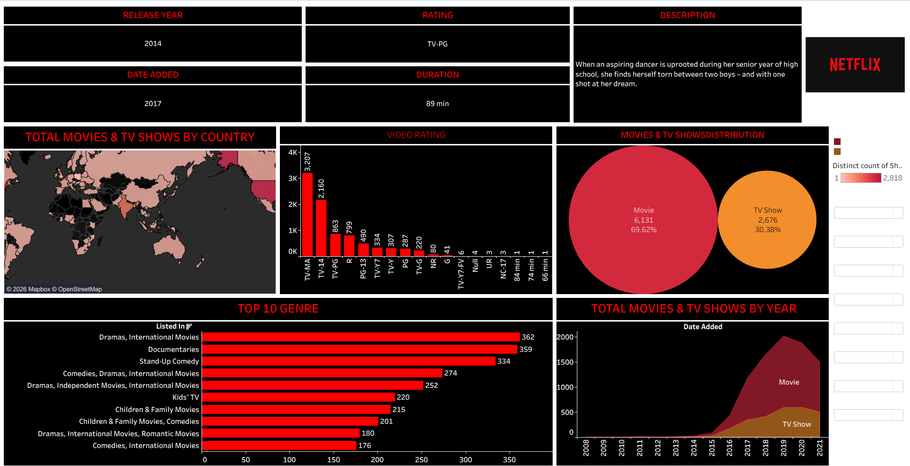
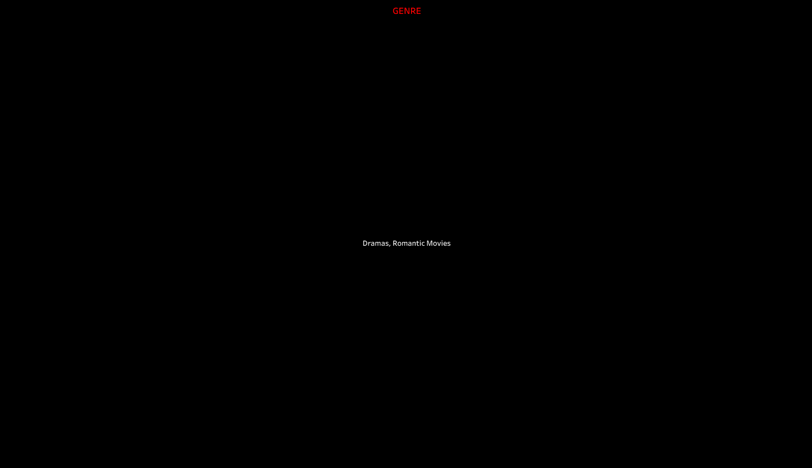
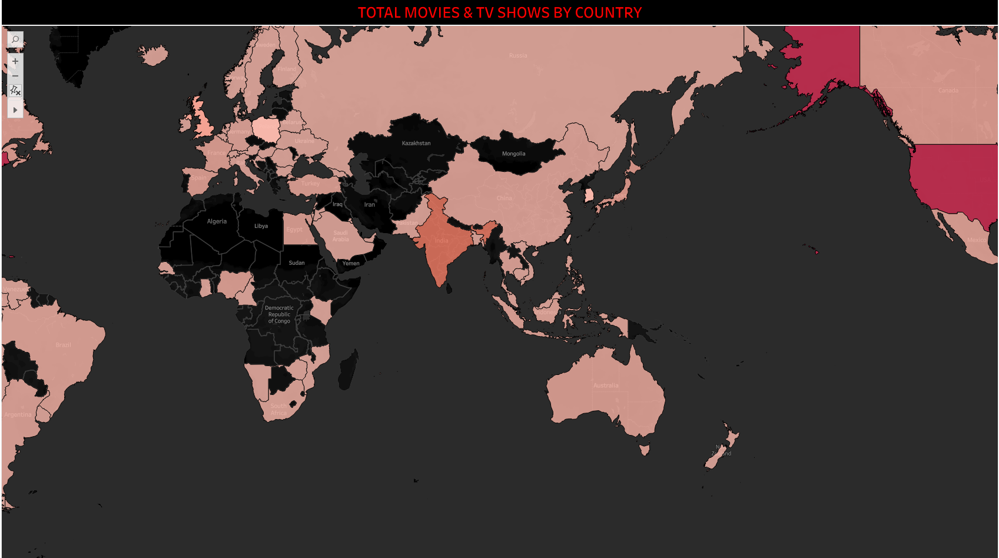

# Netflix Tableau Dashboard

## Project Overview
This project presents an interactive Tableau dashboard developed to analyze Netflix movies and TV shows.  
The dashboard helps in understanding content distribution, genre popularity, country-wise production, and release trends using data visualization techniques.

The objective of this project is to convert raw Netflix data into meaningful insights that support data-driven decision making.

---

## Project Objectives
- Analyze Netflix content distribution across Movies and TV Shows  
- Identify popular genres and producing countries  
- Study content growth trends over time  
- Create an interactive dashboard for analytical exploration  

---

## Tools and Technologies Used
- Tableau – Dashboard development and visualization  
- CSV / Excel – Data source  
- Data Visualization Techniques  
- GitHub – Version control and project documentation  

---

## Dataset Description
The dataset contains information related to Netflix Movies and TV Shows, including:
- Title  
- Content Type (Movie / TV Show)  
- Country  
- Release Year  
- Rating  
- Duration  
- Genre  

The dataset is stored in the `dataset/` directory.

---

## Dashboard Features
- Movies vs TV Shows comparison  
- Genre-wise content distribution  
- Country-wise analysis  
- Release year trend visualization  
- Interactive filters for analysis  

---

## Dashboard Preview

---

## Live Dashboard
Tableau Public Link:  
(Add your Tableau Public link here)

---

## How to Use This Project
1. Download the `.twbx` file from the `tableau/` folder  
2. Open it using Tableau Desktop or Tableau Reader  
3. Explore the dashboard using available filters  

---

## Key Insights
- Netflix has more Movies than TV Shows  
- Content production increased significantly after 2016  
- United States and India are the top content-producing countries  
- Drama and International content dominate the platform  

---

## Project Structure
Netflix-Dashboard-analysis/
│
├── dataset/
│ └── netflix_titles.csv
│
├── images/
│ ├── dashboard_overview.png
│ ├── genre_analysis.png
│ └── country_analysis.png
│
├── tableau/
│ └── NETFLIX_DASHBOARD.twbx
│
└── README.md

---

## Use Case
This project demonstrates:
- Data visualization skills  
- Business insight generation  
- Dashboard development using Tableau  
- Real-world dataset analysis  

Suitable for:
- Data Analyst roles  
- Business Intelligence roles  
- Tableau Developer roles  

---

## Author
Pavan Kumar Bommu  
Data Analyst | Tableau | Data Visualization  

---

## Notes
- This project is created for learning and portfolio purposes  
- Dataset used is publicly available  
- No confidential or proprietary data is included  
